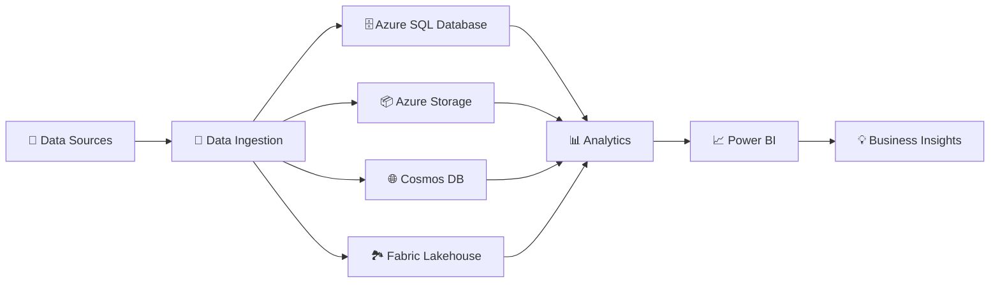
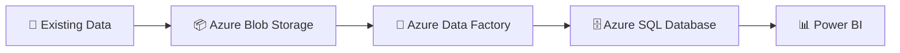
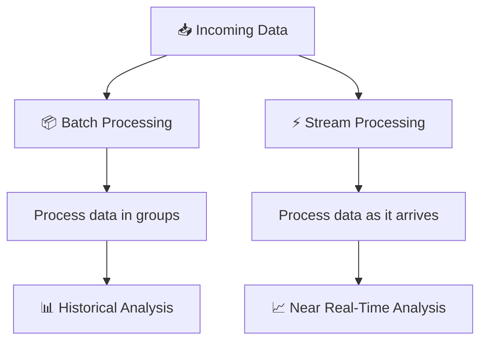
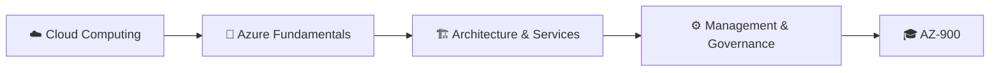

# Azure Data Fundamentals (DP-900) Project – Data Technician Bootcamp

In this repository, I showcase the workbook, lab evidence and supporting materials I completed during the **Azure Data Fundamentals module of the Data Technician Bootcamp**, covering concepts aligned with **Microsoft Azure DP-900**.

## ☁️ Project Overview

During this project, I explored how organisations can store, process, integrate and analyse data using **Microsoft Azure and Microsoft Fabric**.

I developed an understanding of cloud computing fundamentals while working across relational, non-relational and analytical data services.

My practical activities included **Azure SQL Database, Azure Storage, Azure Cosmos DB, Microsoft Fabric, data ingestion, batch processing and stream processing**.

## 🔄 My Cloud Data Architecture



## 🛠️ Skills I Demonstrated

### ☁️ Cloud Computing Fundamentals

I developed an understanding of:

* Cloud computing
* Scalability
* Flexibility
* Reliability
* Pay-as-you-go services
* On-premises versus cloud computing

### 🏗️ Cloud Service Models

I explored:

* **IaaS** – Infrastructure as a Service
* **PaaS** – Platform as a Service
* **SaaS** – Software as a Service

### 🌐 Cloud Deployment Models

I learned about:

* Public cloud
* Private cloud
* Hybrid cloud

### 🗄️ Relational Data

Using **Azure SQL Database**, I explored:

* Tables
* Schemas
* Primary keys
* Foreign keys
* Relationships
* Structured data
* Relational data models

### 📦 Non-Relational Data

I also explored:

* Azure Storage Account
* Blob Storage
* Table Storage
* Azure Cosmos DB
* NoSQL concepts
* Structured, semi-structured and unstructured data

### 🏞️ Analytical Workloads

I developed an understanding of:

* Microsoft Fabric
* Fabric Lakehouse
* Data lakes
* Data warehouses
* Fact and dimension tables
* Analytical modelling

### ⚡ Data Ingestion

I explored different approaches to moving data into analytical platforms, including:

* Batch ingestion
* Stream processing
* Eventstreams
* Azure Data Factory
* CSV
* JSON
* Parquet

## 📈 Key Project Activities

### 🧪 Azure Data Labs

I completed practical exercises exploring:

* Azure SQL Database
* Azure Storage
* Azure Cosmos DB
* Microsoft Fabric
* Power BI

These labs helped me understand which Azure services are most appropriate for different types of data and workloads.

### 🐾 Paws & Whiskers Azure Data Solution

I developed an Azure data proposal for a growing retail pet shop that needed to improve how it managed:

* 🧾 Sales
* 👤 Customers
* 📦 Inventory
* 🏷️ Products
* 🚚 Suppliers
* 🎟️ Loyalty information

My proposed workflow included:



This helped me think about how several Azure services can be combined into a single data architecture.

### ⚡ Batch vs Streaming

I compared two different approaches to processing data:



### 🏞️ Microsoft Fabric Lakehouse

I explored how the Lakehouse approach combines concepts from:

**Data Lakes + Data Warehouses**

to support analytical workloads involving different types of data.

## 💡 Working Across Azure Services

One of the most important things I learned was that a modern data solution rarely relies on a single service.

I learned to think about which tool is most appropriate depending on:

* Data structure
* Data volume
* Processing requirements
* Real-time requirements
* Analytical requirements
* Scalability
* Security

## 🎯 Learning Outcomes

By completing this project, I developed an understanding of:

* Microsoft Azure
* Cloud computing
* IaaS, PaaS and SaaS
* Azure SQL Database
* Azure Storage
* Azure Cosmos DB
* Microsoft Fabric
* Lakehouse architecture
* Eventstreams
* Azure Data Factory
* Batch processing
* Stream processing
* Data lakes
* Data warehouses
* Data modelling
* Power BI

## 🏅 Related Certifications

Alongside the practical Azure work completed during the bootcamp, I completed several **DataCamp courses and certifications** covering cloud computing and the Microsoft Azure ecosystem:

* ☁️ [**Understanding Cloud Computing – DataCamp**](https://www.datacamp.com/completed/statement-of-accomplishment/course/60bd107bcb646fc687916a2383bb21fd0a5e7265?utm_medium=organic_social&utm_campaign=sharewidget&utm_content=soa)
* 🔷 [**Understanding Microsoft Azure – DataCamp**](https://www.datacamp.com/completed/statement-of-accomplishment/course/9d1944e4869d91f2dd9d28313f67487b0d1cc802?utm_medium=organic_social&utm_campaign=sharewidget&utm_content=soa)
* 🏗️ [**Understanding Microsoft Azure Architecture and Services – DataCamp**](https://www.datacamp.com/completed/statement-of-accomplishment/course/675f8851e4072b234c78e321a1e819a6c2c623c3?utm_medium=organic_social&utm_campaign=sharewidget&utm_content=soa)
* ⚙️ [**Understanding Microsoft Azure Management and Governance – DataCamp**](https://www.datacamp.com/completed/statement-of-accomplishment/course/b6975abae7040eb6837cb16e3991514f6d82bb6b?utm_medium=organic_social&utm_campaign=sharewidget&utm_content=soa)
* 🎓 [**Microsoft Azure Fundamentals (AZ-900) – DataCamp**](https://www.datacamp.com/completed/statement-of-accomplishment/track/e767644044dfa18a7c6378abb08c63fdb07b0c6f?utm_medium=organic_social&utm_campaign=sharewidget&utm_content=soa)

These courses strengthened my understanding of cloud concepts, Azure architecture, core services, management, governance and the broader Azure platform alongside the practical data exercises included in this repository.



## 💻 Tools I Used

`Microsoft Azure` `DP-900` `Azure SQL Database` `Azure Storage` `Azure Cosmos DB` `Microsoft Fabric` `Lakehouse` `Eventstreams` `Azure Data Factory` `Power BI`

## 📁 Project Contents

```text
📦 Azure-Data-Fundamentals
 ┣ ☁️ Azure workbook
 ┣ 🗄️ Azure SQL exercises
 ┃ ┗ 🗄️ 01 - Explore Azure SQL Database
 ┣ 📦 Storage exercises
 ┃ ┗ 📦 02 - Explore Azure Storage
 ┣ 🐾 Azure Cosmos DB exercises
 ┃ ┗ 🐾 03 - Explore Azure Cosmos DB
 ┣ 🏞️ Microsoft Fabric exercises
 ┃ ┗ 🏞️ 04 - Explore data analytics in Microsoft Fabric
 ┣ 📊 Power BI exercises
 ┃ ┗ 📊 06 - Explore fundamentals of data visualization with Power BI
 ┣ 🐾 Paws & Whiskers proposal and example of data visualisation
 ┣ 📁 certificates
 ┃ ┣ 📄 DataCamp Certificate - Understanding Cloud Computing.pdf
 ┃ ┣ 📄 DataCamp Certificate - Understanding Microsoft Azure.pdf
 ┃ ┣ 📄 DataCamp Certificate - Understanding Microsoft Azure Architecture and Services.pdf
 ┃ ┣ 📄 DataCamp Certificate - Understanding Microsoft Azure Management and Governance.pdf
 ┃ ┗ 📄 DataCamp Certificate - Microsoft Azure Fundamentals (AZ-900).pdf
 ┗ 📄 README.md

```
